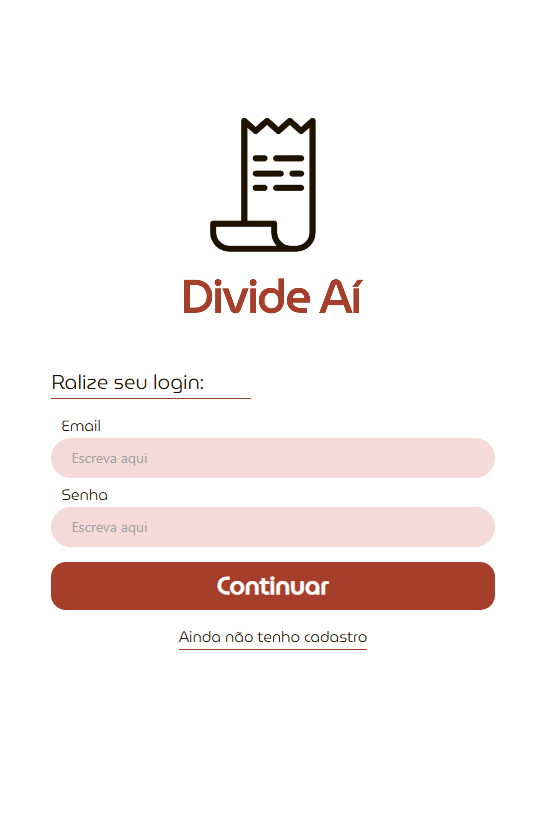
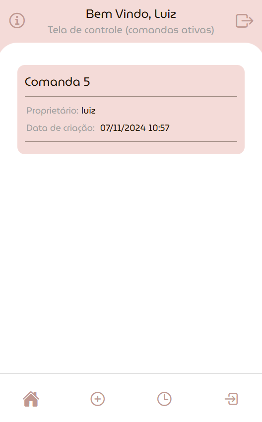
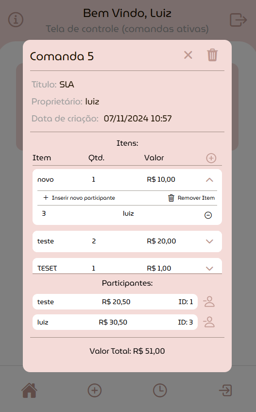
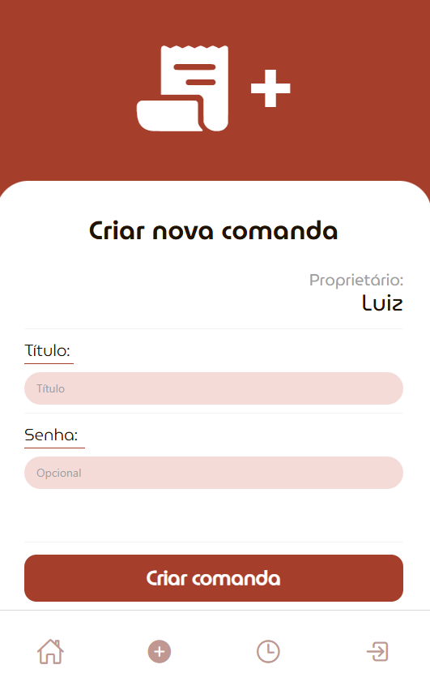

# 🍽️ Comanda Online - DivideAí

Uma aplicação móvel para gerenciar comandas online, permitindo a divisão automática de contas entre participantes de forma prática e eficiente.

## Sobre o Aplicativo

O **DivideAí** é um aplicativo de comanda online que facilita o gerenciamento de pedidos em grupo. Com ele, você pode:

- 👤 **Registro e Login**: Sistema de autenticação seguro para usuários
- 📝 **Criar Comandas**: Iniciar novas comandas para eventos ou refeições em grupo
- 🛒 **Adicionar Itens**: Inserir produtos com preços na comanda
- 👥 **Convidar Participantes**: Adicionar pessoas à comanda
- 💰 **Divisão Automática**: Calcular automaticamente quanto cada pessoa deve pagar
- 📊 **Histórico**: Visualizar comandas anteriores

## Tecnologias Utilizadas

### Frontend (Mobile)
- **React Native** - Framework para desenvolvimento mobile
- **Expo** - Plataforma para desenvolvimento React Native
- **TypeScript** - Tipagem estática para JavaScript
- **Expo Router** - Navegação baseada em arquivos
- **Native Base** - Biblioteca de componentes UI
- **Axios** - Cliente HTTP para comunicação com API

### Backend
- **Node.js** - Runtime JavaScript
- **Express.js** - Framework web para Node.js
- **PostgreSQL** - Banco de dados relacional
- **pg-promise** - Cliente PostgreSQL para Node.js
- **CORS** - Middleware para requisições cross-origin

## Estrutura do Projeto

```
comanda_online/
├── app/                    # Aplicação React Native
│   ├── (main)/            # Telas principais do app
│   │   ├── index.tsx      # Dashboard principal
│   │   ├── novaComanda.tsx # Criação de comandas
│   │   ├── ParticiparComanda.tsx # Participar de comandas
│   │   └── Historico.tsx  # Histórico de comandas
│   ├── login.tsx          # Tela de login
│   ├── Cadastro.tsx       # Tela de cadastro
│   └── _layout.tsx        # Layout principal
├── components/            # Componentes reutilizáveis
│   ├── Comanda.tsx        # Componente de comanda
│   ├── Item.tsx           # Componente de item
│   ├── CustomButton.tsx   # Botões personalizados
│   └── Header.tsx         # Cabeçalho da aplicação
├── server/                # Backend da aplicação
│   ├── index.js           # Servidor principal
│   ├── controllers/       # Controladores das rotas
│   ├── routes/           # Definição das rotas
│   └── db/               # Configuração do banco de dados
├── hooks/                # Custom hooks React
└── constants/            # Constantes da aplicação
```

## Como Executar

### Pré-requisitos
- Node.js instalado
- PostgreSQL configurado
- Expo CLI instalado globalmente

### 1. Configurar o Backend

```bash
# Instalar dependências
npm install

# Configurar banco de dados PostgreSQL
# Execute os scripts em server/db/database.sql

# Iniciar o servidor backend
npm run start-backend
```

### 2. Executar o App Mobile

```bash
# Instalar dependências (se ainda não feito)
npm install

# Iniciar o app com Expo
npm start
```

### Opções de visualização:
- **Expo Go** - No dispositivo físico
- **Emulador Android** - Para desenvolvimento Android
- **Simulador iOS** - Para desenvolvimento iOS (macOS)
- **Web** - Visualização no navegador

## Imagens

<div style="display: flex; flex-wrap: wrap; gap: 24px; justify-content: flex-start;">

<div align="center" style="flex: 1;">
   <br/>
   <sub>Tela de login/cadastro</sub>
</div>

<div align="center" style="flex: 1;">
   <br/>
   <sub>Dashboard principal</sub>
</div>

</div>

<div style="display: flex; flex-wrap: wrap; gap: 24px; justify-content: flex-start;">

<div align="center" style="flex: 1;">
   <br/>
   <sub>Comanda em funcionamento</sub>
</div>

<div align="center" style="flex: 1;">
   <br/>
   <sub>Criação de comandas</sub>
</div>

</div>

---

**Desenvolvido para a disciplina Planejameto e Gestão de Projetos**   
Por:
- Luiz Faccio
- [João Henrique Alves dos Santos](https://github.com/joaohenalves)
- [Marco Balestrin](https://github.com/marcobalestrin)
